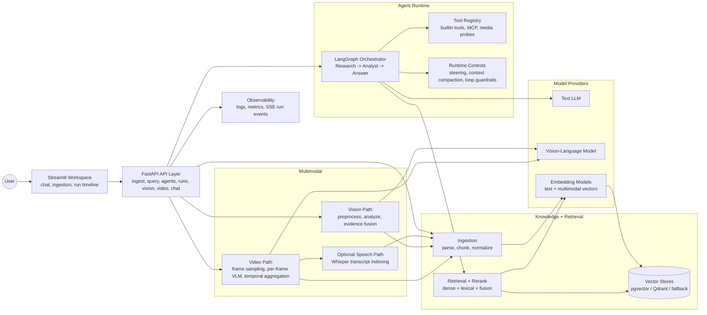

# multimodal-multiagent-AI-assistant

Multimodal assistant with:
- Text RAG ingestion/query
- Multi-agent orchestration (LangGraph)
- Vision and video endpoints
- Streamlit frontend for end-to-end usage

Current delivery status (2026-03-09):
- M0-M3 complete and consolidated.
- M4.1 complete: video path now supports strict frame decode + per-frame VLM analysis + temporal aggregation, while preserving API contracts.
- M2.3 complete: live runtime status telemetry + bounded revision orchestration (`/runs/{run_id}/events`, `/runs/{run_id}/status`).
- M2.4 complete: durable chat sessions (multi-chat history), chat-scoped file/context storage, and transcript-grade runtime timeline.
- M5.1 complete: context compaction slice (checkpoint schema + compactor + orchestrator guard + tests).
- M5.2 complete: steering controls (profiles + grounding/tool policy enforcement).
- M5.3 complete: multimodal embedding/reranking stack with named vectors (`text_dense`/`mm_dense`) and true VL provider wiring.
- Video ingestion can index timestamped speech transcript evidence via local Whisper ASR (`MMAA_MULTIMODAL_VIDEO_AUDIO_TRANSCRIPTION_*`).
- Frontend chat workspace now uses backend-persisted sessions and run transcripts.

## Functional Architecture (High-Level)


What to look at as a newcomer:
- `app/api/routes/*`: HTTP surface (ingest, query, agents, runs, vision, video, chat, metrics).
- `app/agents/*`: multi-agent orchestration, loop control, checkpointing, and progress mapping.
- `app/rag/*` + `app/storage/*`: ingestion, embeddings, retrieval/reranking, and vector-store adapters.
- `app/vision/*` + `app/video/*` + `app/multimodal/*`: image/video analysis and model adapters.
- `app/core/*`: steering policies, context compaction, event bus, dependency/config wiring.
- `frontend/streamlit_app.py`: end-to-end UX that exercises the backend capabilities.

## Skills Demonstrated In This Project
- End-to-end AI system design: clear layering from UI/API to orchestration, retrieval, multimodal analysis, and storage.
- Agent engineering: staged research -> analysis -> answer flow with bounded revision loops and guardrails.
- Retrieval engineering: modular chunking/embedding/retrieval/reranking with pluggable vector backends.
- Multimodal integration: vision + video pipelines, strict frame decoding, and optional audio transcript indexing.
- Backend architecture: contract-oriented FastAPI routes and interface-based adapters for providers/tools/stores.
- Runtime reliability: checkpointing, context compaction, steering controls, and live run-event telemetry.
- Product thinking: usable Streamlit workspace with persisted chat sessions and inspectable runtime traces.
- Engineering rigor: milestone-driven delivery with focused tests across API, orchestration, multimodal, and storage paths.

## Stack
- Backend: FastAPI
- Orchestration: LangGraph
- Frontend: Streamlit
- Vector store: pgvector (default) or Qdrant
- Model providers: heuristic fallback, OpenAI, or local OpenAI-compatible servers (Ollama/vLLM)

## 1. Prerequisites
- Python 3.11+
- Docker Desktop
- NVIDIA GPU optional (recommended for local models)

## 2. Install
```powershell
python -m venv .venv
.\.venv\Scripts\Activate.ps1
pip install -r requirements.txt
```

Optional for M4.1 local decoded-frame extraction:
```powershell
pip install opencv-python
```

Optional for video-audio transcript indexing during ingestion:
- `ffmpeg` available in `PATH`
- local Whisper model download on first run (package already in `requirements.txt`)

## 3. Create `.env`
```powershell
Copy-Item .env.example .env
```

## 4. Lift Local Model Backend (Ollama, in container)
CPU mode (no GPU passthrough):
```powershell
docker compose -f deployment/docker-compose.ollama.yml up -d
```

GPU mode:
```powershell
docker compose -f deployment/docker-compose.ollama.yml -f deployment/docker-compose.ollama.gpu.yml up -d
```

Verify active inference processor:
```powershell
docker exec -it mm_maa_ollama ollama ps
```

Pull at least one local text model:
```powershell
docker exec -it mm_maa_ollama ollama pull qwen3:4b
```

Optional local multimodal + embeddings models:
```powershell
docker exec -it mm_maa_ollama ollama pull qwen3-vl:2b
docker exec -it mm_maa_ollama ollama pull nomic-embed-text
```

Set local provider config in `.env`:
```dotenv
MMAA_LLM_PROVIDER=openai
MMAA_LLM_MODEL=qwen3:4b
MMAA_LLM_BASE_URL=http://localhost:11434/v1
MMAA_LLM_API_KEY=local-placeholder

MMAA_RAG_EMBEDDING_PROVIDER=openai
MMAA_RAG_EMBEDDING_MODEL=nomic-embed-text
MMAA_RAG_OPENAI_BASE_URL=http://localhost:11434/v1
MMAA_RAG_OPENAI_API_KEY=local-placeholder

MMAA_MULTIMODAL_PROVIDER=openai
MMAA_MULTIMODAL_VISION_MODEL=qwen3-vl:2b
MMAA_MULTIMODAL_BASE_URL=http://localhost:11434/v1
MMAA_MULTIMODAL_API_KEY=local-placeholder
```

## 5. Optional: Lift Qdrant
```powershell
docker compose -f deployment/docker-compose.qdrant.yml up -d
```

If using Qdrant, set in `.env`:
```dotenv
MMAA_RAG_VECTOR_STORE_PROVIDER=qdrant
MMAA_QDRANT_URL=http://localhost:6333
MMAA_QDRANT_COLLECTION_NAME=rag_chunks
MMAA_RAG_VECTOR_STORE_MIRROR_WRITES=true
```

## 6. Lift Backend
```powershell
.\.venv\Scripts\Activate.ps1
python -m uvicorn app.main:app --host 0.0.0.0 --port 8000 --reload
```

Health check:
```powershell
Invoke-RestMethod -Method Get -Uri http://localhost:8000/health
```

## 7. Lift Frontend
In a second terminal:
```powershell
.\.venv\Scripts\Activate.ps1
python -m streamlit run frontend/streamlit_app.py
```

Open:
- Frontend: `http://localhost:8501`
- Backend API docs: `http://localhost:8000/docs`
- Frontend ingestion supports file upload plus clipboard image paste (`Ctrl+V`) via `streamlit-paste-button`.

Supported ingestion formats (current):
- Documents: `pdf`, `docx`, `pptx`, `xlsx`, `txt`, `md/markdown`, `html/htm`, `csv`, `tsv`, `json/jsonl`, `yaml/yml`, `xml`, `log`, `ini`, `cfg`, `toml`
- Media: common image/video extensions supported by the multimodal pipeline, indexed into the same RAG structure with modality metadata

## 8. Minimal API Smoke Test
Ingest a local file:
```powershell
$p = Join-Path $env:TEMP "mmaa_demo.txt"
"Retention policy is 30 days for logs." | Set-Content -Path $p -Encoding UTF8
$uri = [System.Uri]::new($p).AbsoluteUri
$body = @{ sources = @($uri); source_type = "text" } | ConvertTo-Json
Invoke-RestMethod -Method Post -Uri http://localhost:8000/ingest/documents -ContentType "application/json" -Body $body
```

Query:
```powershell
$body = @{ query = "What is the retention policy?"; top_k = 3 } | ConvertTo-Json
Invoke-RestMethod -Method Post -Uri http://localhost:8000/query -ContentType "application/json" -Body $body
```

## 9. Stop Everything
Stop backend/frontend terminals with `Ctrl+C`.

Stop containers:
```powershell
docker compose -f deployment/docker-compose.ollama.yml down
docker compose -f deployment/docker-compose.qdrant.yml down
```

Remove container volumes too (optional):
```powershell
docker compose -f deployment/docker-compose.ollama.yml down -v
docker compose -f deployment/docker-compose.qdrant.yml down -v
```

## Notes
- If you keep `auto` providers, the app can fall back to heuristic/deterministic behavior.
- To force local model usage, explicitly set provider env vars to `openai` plus `*_BASE_URL`.
- Local vision with `file://` image paths is supported by the multimodal adapter.
- Vision preprocessing can resolve webpage URLs to concrete image assets before model inference.
- Video analysis uses strict decode-based frame extraction (`cv2` required) and fails explicitly if decode cannot run.
- Video ingestion can append timestamped audio transcripts (Whisper) so spoken content is retrievable in RAG.
